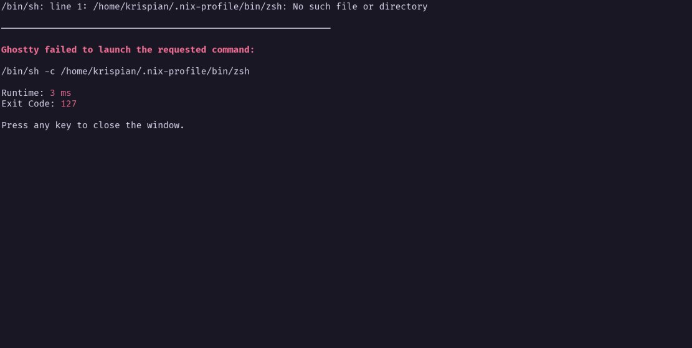

+++
title = '~~Truth~~ Chroot or Dare'
date = 2025-05-08T07:07:07+01:00
draft = false
+++

It was a late evening before a working day (doesn't any good story start like this?). I was thinking why the new Nix API wasn't working for me by default. TLDR: the thing about Nix is that there's a legacy API (`nix-command`) and a "new" API (`nix command`), which becomes available by enabling the so-called "experimental features" for Nix. Legacy or experimental. Nothing in between. Though to an outsider it might sound odd, the "experimental" features have long been established and widely used in the Nix community so their "experimental" status is a mere formality.

I needed the new and flashy. I could of course have enabled the experimental features manually but a quick look revealed that I was using [upstream Nix](https://github.com/NixOS/nix) as opposed to [Nix by Determinate Systems](https://github.com/DeterminateSystems/nix-installer) (the defacto standard installation in the community) which enables all the juicy things by default. Hm, I thought, what harm can it do to uninstall my current Nix and replace it with the Determinate Systems one? Surely it's a fairly quick fix.

I'm going through the rather [awkward deinstallation process](https://nix.dev/manual/nix/2.18/installation/uninstall#linux) when I realize that the default shell for my user was `zsh` that was managed by `nixpkgs`. Which I nuked when I removed the Nix store. The result - I couldn't start a shell session. Not in a terminal emulator, not in the system console, not in the TTY. I thought I was cooked. Rip the system.

## Chroot to the rescue

You can see where this is going. I dusted off the USB with an Arch ISO, booted into the live system. [Decrypted](./backup.md#encryption) and mounted the root partition just like daddy taught me and chrooted into my installed system. Changed the default shell back to system `bash`, rebooted - profit.

Installing Nix by Determinate Systems goes like a breeze, with all the experimental features out of the box. Now bootstrapping my user environment with `home-manager` and setting the default shell back to `home-manager` managed `zsh`.

Boys, we're back in the game.
